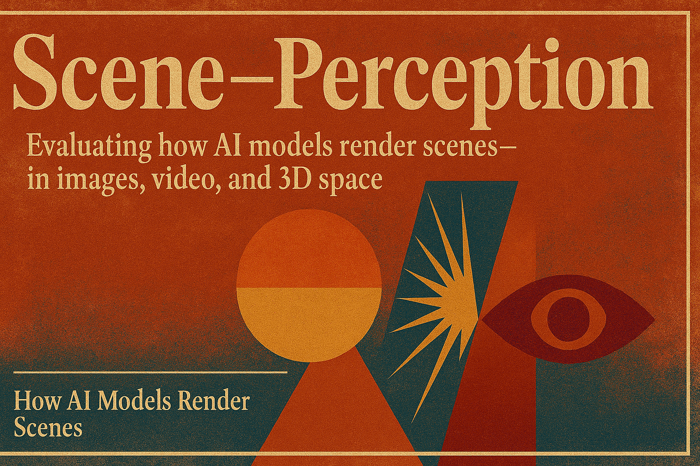

# 🔭 Jeff Barry

**`educator, indie game developer, writer, full-stack developer`**

🌱 crafting tools for interactive storytelling

💬 I'm a Lecturer of Data Science at Washington and Lee University. 

📚 🖥️ ✍️ My life's work—as an educator, software engineer, writer, or reader—is understanding how we convey and experience stories, both fictional and factual, through digital media. The future of my child’s life is the lens through which I view the changing shape of creativity, learning, and leisure in the twenty-first century.

---

### 🛠️ Programming Languages & Frameworks

          

 
 

### 🧰 Tools

 

#
### 📺 Latest Videos from my YouTube Channel @AILessons
<!-- BEGIN YOUTUBE-CARDS -->

<!-- END YOUTUBE-CARDS -->

# 

### 📺 Read my Substack newsletter: The Metaverse is Open

#

### 🧪 Work-in-Progress: Generative AI Benchmarks

#
