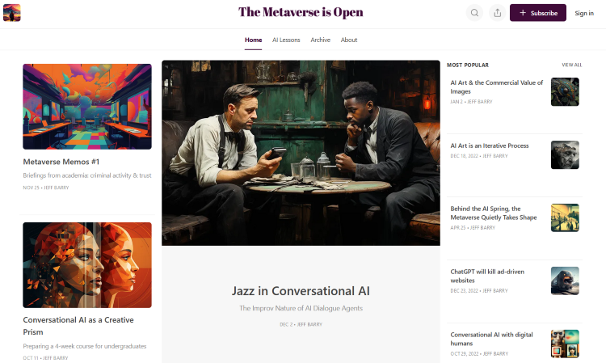

# 🔭 Jeff Barry

**`data scientist, writer, full-stack developer`**

🌱 crafting tools for interactive storytelling

💬 I'm an Associate Professor of Data Science & Digital Culture and Information at Washington and Lee University. 

📚 🖥️ ✍️ At the core of my life's work—whether in my roles as a librarian, software developer, writer, or reader—lies a deep commitment to comprehending the ways we craft and consume stories, both fictional and factual, within digital media. Viewing the evolving landscape of creativity, learning, and leisure through the prism of my child's future profoundly shapes my vision for contributing to the evolution of narrative in the twenty-first century.

---

### 🛠️ Programming Languages & Frameworks

          

 
 

### 🧰 Tools

 

#
### 📺 Latest Videos from my YouTube Channel @AILessons
<!-- BEGIN YOUTUBE-CARDS -->

<!-- END YOUTUBE-CARDS -->

# 

### 📺 Read my Substack newsletter: The Metaverse is Open

#

<!--
**jeffreybarry/jeffreybarry** is a ✨ _special_ ✨ repository because its `README.md` (this file) appears on your GitHub profile.

Here are some ideas to get you started:

-  I’m currently working on ...
-  I’m currently learning ...
- 👯 I’m looking to collaborate on ...
- 🤔 I’m looking for help with ...
-  Ask me about ...
- 📫 How to reach me: ...
- 😄 Pronouns: ...
- ⚡ Fun fact: ...
-->
